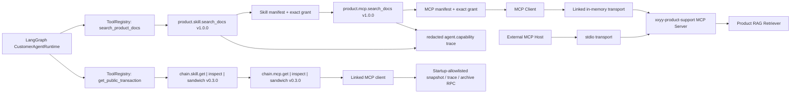
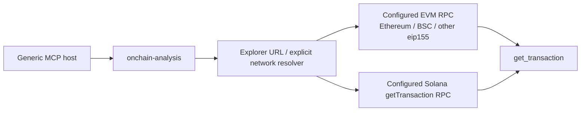
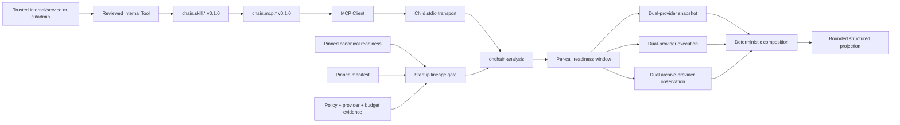

# MCP / Skill Capability Plane v0.5

## 当前状态

Capability Plane 已完成产品检索、公开交易查询与证据受控的深度链上分析接入：

- `packages/product-qa-mcp` 提供 `xxyy-product-support` MCP server/client。
- MCP 只暴露只读 `search_product_docs`、`xxyy://skills/product-support` Resource 和 `xxyy_product_support` Prompt。
- `skills/xxyy-product-support` 是项目级 Skill，规定检索、引用、证据不足与边界处理流程。
- Web/API、CLI 和 Telegram 的 LangGraph runtime 都通过同一条 Skill → MCP bridge 检索产品知识。
- `packages/chain-analysis-mcp` 提供与产品域解耦的 `onchain-analysis` MCP server/client、`get_transaction`、`inspect_transaction`、`detect_sandwich`、capabilities/Skill Resources 与 Prompts。
- `get_transaction` 解析六条内置链的 Explorer 链接或显式 network + transaction id，通过配置的 EVM/Solana RPC 查询；工具输入不接受 endpoint。
- `skills/onchain-transaction-inspector` 和 `skills/evm-sandwich-detector` 默认禁止外部 MCP host 隐式调用；XXYY 公开 composition 只为固定 `web/anonymous` 与 `telegram/service` 创建三项 Chain 工具的六条精确授权，内部 factory 仍只接受 `internal/(service|admin)` 或 `cli/admin`。
- `pnpm onchain:mcp:dev` 自动读取根目录 `.env` 中必填的 `ONCHAIN_RPC_CONFIG_JSON`。`evm` / `solana` 配置基础快照，可选 `execution` 和 `mevObservation` 分别配置 trace/factory 与 archive/pool allowlist；`.env.example` 的免费公共 RPC 便利配置本身不启用 Sandwich。
- `pnpm onchain:query` 是固定 `cli/admin` 的开发集成入口，实际执行 Tool → Skill → MCP 两层授权与 linked in-memory MCP protocol；生产环境失败关闭。
- `pnpm onchain:query:production` 是固定 `cli/admin` 的生产内部查询入口，通过子进程 stdio 连接 readiness-gated composition；不读取 `.env`，门禁失败时不回退公共 RPC。
- `pnpm chain:mcp:serve` 是 XXYY 的 production composition，只有在固定 data-plane manifest 和 canonical readiness lineage 当前有效时才启动，且每次调用继续检查 attestation 时间窗。
- 用户提供的公开交易引用基础查询、单笔 EVM inspection 和 allowlisted pool Sandwich/MEV 判断已开放；账户、订单、钱包余额、任意地址历史、地址归属、交易执行和投资建议仍不开放。

Planner 的业务工具列表只包含经过审查且由 composition root 注册的 `search_product_docs` 与可选 `get_public_transaction`。公开交易引用先走确定性路由；MCP discovery、Resource 或 Skill 元数据不会自动注册工具，也不会自动生成 grant。

## 执行链



API、CLI 和 Telegram 使用 MCP SDK 的 linked in-memory transport，因此无需启动旁路子进程，但仍执行标准 MCP initialize 和 `tools/call`。同一 server surface 支持外部 MCP host 发现 Tool、Resource 和 Prompt；可运行：

```bash
pnpm product:mcp:dev
```

stdio server 使用与正式 Product RAG 相同的 `.env`、embedding 和 pgvector 配置。stdout 专用于 MCP protocol。

通用 MCP 的开发 composition 与 XXYY production composition 共享同一 server surface，但配置和可信度不同。基础开发路径为：



XXYY 内部 production composition 使用独立的生产数据面和 control DB：



```bash
pnpm onchain:mcp:dev
pnpm chain:mcp:serve
NODE_ENV=production pnpm onchain:query:production -- help
```

`onchain:mcp:dev` 自动读取根目录 `.env` 中的 `ONCHAIN_RPC_CONFIG_JSON`，同名进程环境变量优先；该变量在所有 `NODE_ENV` 下都必填，运行时代码不包含 RPC endpoint 或开发/生产 Provider 分支。`.env.example` 提供六链公共 RPC 便利值，生产部署沿用同一 JSON 结构替换为托管 Provider。`chain:mcp:serve` 仍不读取项目 `.env`，并要求 deployment environment 显式提供独立 control DB、manifest/secret mount、instance identity，以及：

- `CHAIN_ANALYSIS_DATA_PLANE_MANIFEST_FINGERPRINT`；
- `CHAIN_ANALYSIS_READINESS_FINGERPRINT`。

启动时会重读指定 readiness attestation、operations evidence 与 policy，要求状态为 `ready`、时间未过期、policy 覆盖 Ethereum chain 1 与 snapshot/execution/mev_observation 三类 adapter、每类至少两个 Provider，并逐条匹配 manifest 中的 Provider descriptor 与 budget policy fingerprint。先通过门禁才解析 Provider secrets。缺失、过期或 lineage 漂移都以稳定配置错误失败关闭。仓库没有提交真实 fingerprint、endpoint、credential 或 `ready` 证明。

## 已注册能力

| Capability                        | Source  | Risk     | Side effect     | Data scope                           | Agent 可见      |
| --------------------------------- | ------- | -------- | --------------- | ------------------------------------ | --------------- |
| `product.skill.search_docs`       | `skill` | low      | `external_read` | `product.public`                     | 公开固定 bridge |
| `product.mcp.search_docs`         | `mcp`   | low      | `external_read` | `product.public`                     | 不直接暴露      |
| `chain.skill.get_transaction`     | `skill` | moderate | `external_read` | public EVM/Solana transaction        | 公开固定 bridge |
| `chain.mcp.get_transaction`       | `mcp`   | moderate | `external_read` | public EVM/Solana transaction        | 公开间接授权    |
| `chain.skill.inspect_transaction` | `skill` | moderate | `external_read` | public EVM transaction/execution     | 公开固定 bridge |
| `chain.mcp.inspect_transaction`   | `mcp`   | moderate | `external_read` | public EVM transaction/execution     | 公开间接授权    |
| `chain.skill.detect_sandwich`     | `skill` | moderate | `external_read` | public EVM transaction/execution/MEV | 公开固定 bridge |
| `chain.mcp.detect_sandwich`       | `mcp`   | moderate | `external_read` | public EVM transaction/execution/MEV | 公开间接授权    |

两项 Product 能力均固定为 `1.0.0`，单次 timeout 为 30 秒，最大 JSON 输出为 262144 bytes。六项 Chain 能力固定为 `0.3.0`；基础 transaction query 的 timeout/output 上限为 30 秒/524288 bytes，EVM transaction inspection 为 60 秒/524288 bytes，Sandwich 为 120 秒/1048576 bytes。它们都是只读 external read，不要求确认或幂等 key。Skill adapter 只能调用同一 Registry 内已授权的 MCP capability。

可信调用身份由 composition root 固定，不能来自 Planner 或聊天 payload：

| 入口             | Channel    | Principal   |
| ---------------- | ---------- | ----------- |
| HTTP/Web         | `web`      | `anonymous` |
| CLI              | `cli`      | `user`      |
| Telegram Bot     | `telegram` | `service`   |
| 默认内部 runtime | `agent`    | `service`   |

产品 runtime 为产品 Skill/MCP 创建覆盖自身 channel/principal 的两条精确 grant。配置 `ONCHAIN_RPC_CONFIG_JSON` 时，Web 与 Telegram 另为三项 Chain 工具创建六条精确 grant。使用其它 channel、principal、source、version、side effect 或 data scope 会在解析业务输入前拒绝。

XXYY 提供两个分离的 Chain registry factory：公开 factory 只接受 `web/anonymous` 或 `telegram/service`，内部 factory 只接受 `internal/(service|admin)` 或 `cli/admin`；两者都为三个 Skill/MCP 对创建六条仅覆盖固定 caller 的 grant。数据权限没有合并：公开查询只能使用启动时配置的公开链数据，生产深度 composition 继续由 readiness、Provider lineage、budget 和 pool allowlist 门禁。独立 MCP host 可以安装通用 Skills，但这不自动改变 XXYY 授权。

## MCP 与 Skill Surface

### Tool

`search_product_docs` 输入：

```json
{
  "query": "XXYY Pro 权益",
  "question": "XXYY Pro 有哪些权益？",
  "topK": 6
}
```

- `query` 必填。
- `question` 可选，用完整原问题约束 citation selection。
- `topK` 可选，内部上限固定为 20；reranker candidate expansion 仍受现有上限控制。

输出经过 Zod、JSON serialization 和 byte limit 三层校验，包含安全化 chunks、citations、可选 attachments 和 confidence。embedding、tokens、凭证类文本和已隔离 prompt injection 不会作为原始内部数据返回。

### Skill

项目 Skill 位于 `skills/xxyy-product-support`。MCP server 同时将其运行说明作为 Resource 和 Prompt 暴露，供支持对应能力的 MCP host 使用。

Skill 是受控编排层，不是权限来源。Skill 文件提到某项能力，不代表 Registry 已注册或已授权该能力。

### Chain Tools 与 Skills

`get_transaction` 接受支持的 Explorer URL，或显式 `network` 与一个 transaction id。当前内置 URL resolver 支持 Solscan/Solana Explorer、Etherscan、BscScan、Basescan/Base Blockscout、Robinhood Blockscout 和 Stablescan；其它配置的 EVM 使用 `eip155:<chainId>` 与 raw hash。交易事实由启动时配置的 RPC 提供，Explorer API 不作为隐式来源。

`inspect_transaction` 只接受 EVM `chainId` 与一个 transaction hash；`detect_sandwich` 另要求一个已经验证、且位于启动 allowlist 的 pool address。MCP 不接受 endpoint、provider id、任意 JSON-RPC method、block range、账户凭证或私有数据。

输出复用 deterministic harness 的 transaction/execution/MEV projection，保留 evidence、coverage、conflicts、warnings、diagnostics、fingerprints 和 `success | partial | insufficient_data`。Sandwich verdict 原样保留 `confirmed | likely | unlikely | insufficient_data`；MCP 不返回构建判定所用的 raw observation payload。

两个通用 Chain Skills 位于 `skills/onchain-transaction-inspector` 与 `skills/evm-sandwich-detector`。Transaction workflow 先执行 `get_transaction`，EVM 需要深度证据时再执行 `inspect_transaction`。Sandwich workflow 只能从已验证 swap evidence 选 pool；多 pool 时不得猜测。Skill metadata 的 `allow_implicit_invocation` 为 `false`，且 metadata 本身不授予执行权限。

## Manifest 与授权规则

每个 Capability 必须声明：

| 字段                   | 约束                                                                 |
| ---------------------- | -------------------------------------------------------------------- |
| `id`                   | 小写 namespace id                                                    |
| `version`              | 精确 semver；grant 不跨版本继承                                      |
| `source`               | `builtin`、`skill` 或 `mcp`，必须与 adapter 一致                     |
| `risk`                 | `low`、`moderate`、`high` 或 `critical`                              |
| `sideEffect`           | `none`、`external_read`、`external_write` 或 `financial_transaction` |
| `dataScopes`           | 非空、唯一的最小数据范围                                             |
| `requiresConfirmation` | 外部写入和金融交易必须为 `true`                                      |
| `idempotency`          | 外部写入和金融交易必须为 `required`                                  |
| `limits`               | timeout 与最大 JSON 输出 bytes                                       |

能力被描述、注册、授权和暴露给 Agent 是四个独立步骤。远端 MCP discovery 或本地 Skill metadata 只能作为待审核定义，不能隐式完成后续步骤。

## 单次调用流程

1. 使用 composition root 固定的 channel/principal 创建调用上下文。
2. 查找精确 capability id；未注册调用也写入不含 payload 的审计记录。
3. 执行 deny-by-default policy。
4. 校验 input schema。
5. 取 manifest 与 Registry 全局 timeout/output limit 中的更小值。
6. Skill capability 调用 MCP capability，MCP Client 通过 transport 执行 `tools/call`。
7. 校验 MCP structured output、Capability output schema、JSON serialization 和大小。
8. 返回 ToolRegistry，由 observation 和 answer composer 继续处理。

Product MCP handler 将配置类故障编码为稳定错误类别；进程内 client 会恢复为现有 `EmbeddingConfigurationError`、`VectorStoreConfigurationError` 或 `VectorStoreUnavailableError`，保证 API 继续区分 embedding 配置、vector store 配置和运行时不可用。Chain MCP 只跨协议返回 `chain_not_configured`、`pool_not_configured`、`provider_unavailable`、`request_aborted`、`runtime_not_ready`、`tool_timeout`、`output_too_large` 或 `tool_failure`。其它 provider/adapter 错误不会把异常原文、endpoint 或 credential 跨 MCP 边界返回。

## 审计与隐私

`agent.capability` 只记录 capability id/version/source、channel、principal、risk、side effect、data scope 数量、policy 结果、实际 limits、输入/输出类型与字段/元素数量、输出 bytes。

禁止记录：

- capability 输入或输出值；
- 字段名、完整 query、chunk 正文或 citation 正文；
- session/user id、Authorization、私钥、API key 或 idempotency key；
- MCP/Provider 异常堆栈与 endpoint；
- 账户、钱包或私有交易数据。

Tool trace、Skill trace、MCP trace 和 RAG trace保持父子关系，便于定位失败层，同时不扩大明文日志。

## 仍未开放或未就绪的能力

三项只读 Chain 工具已接入 Web/API/Telegram，但授权不等于数据就绪：`.env.example` 的公共免费 RPC 没有 SLA，默认没有 execution/archive/pool 配置，不能作为 trace 或 Sandwich 的 production readiness 证明。未配置时 inspection 只返回可验证的 transaction snapshot 并标明 trace 未提供，Sandwich 返回配置/池子提示；不得将其解释为 negative verdict。任意地址历史、地址归属、任意池发现、账户数据和交易执行仍不开放。`pnpm onchain:query:production` 只接入 readiness-gated stdio composition，不代表外部证据已经具备；深度 production composition 仍缺真实 Provider credential、reviewed mainnet corpus、SLO/security/runbook evidence 和 canonical `ready` attestation。
