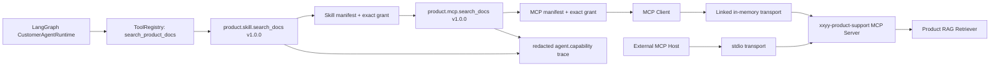
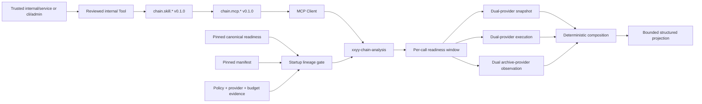

# MCP / Skill Capability Plane v0.3

## 当前状态

Capability Plane 已完成产品检索的公开运行面接入，以及链上分析的内部受控接入，但没有扩大公开客服业务边界：

- `packages/product-qa-mcp` 提供 `xxyy-product-support` MCP server/client。
- MCP 只暴露只读 `search_product_docs`、`xxyy://skills/product-support` Resource 和 `xxyy_product_support` Prompt。
- `skills/xxyy-product-support` 是项目级 Skill，规定检索、引用、证据不足与边界处理流程。
- Web/API、CLI 和 Telegram 的 LangGraph runtime 都通过同一条 Skill → MCP bridge 检索产品知识。
- `packages/chain-analysis-mcp` 提供内部 `xxyy-chain-analysis` MCP server/client、两个只读 Tool、capabilities/Skill Resources 与 Prompts。
- `skills/xxyy-evm-transaction-inspector` 和 `skills/xxyy-evm-sandwich-detector` 默认禁止隐式调用；Chain Capability factory 只接受 `internal/(service|admin)` 或 `cli/admin`。
- `pnpm chain:mcp:serve` 只有在固定 data-plane manifest 和 canonical readiness lineage 当前有效时才启动，且每次调用继续检查 attestation 时间窗。
- 交易哈希、Explorer、池子、链上取证、MEV、账户、订单、钱包余额和投资建议仍不开放。

Planner 的业务工具列表仍只有经过审查的 `search_product_docs`。MCP discovery、Resource 或 Skill 元数据不会自动注册工具，也不会自动生成 grant。

## 执行链



API、CLI 和 Telegram 使用 MCP SDK 的 linked in-memory transport，因此无需启动旁路子进程，但仍执行标准 MCP initialize 和 `tools/call`。同一 server surface 支持外部 MCP host 发现 Tool、Resource 和 Prompt；可运行：

```bash
pnpm product:mcp:dev
```

stdio server 使用与正式 Product RAG 相同的 `.env`、embedding 和 pgvector 配置。stdout 专用于 MCP protocol。

内部 Chain MCP 使用独立的生产数据面和 control DB：



```bash
pnpm chain:mcp:serve
```

该命令不读取项目 `.env`。它要求 deployment environment 显式提供独立 control DB、manifest/secret mount、instance identity，以及：

- `CHAIN_ANALYSIS_DATA_PLANE_MANIFEST_FINGERPRINT`；
- `CHAIN_ANALYSIS_READINESS_FINGERPRINT`。

启动时会重读指定 readiness attestation、operations evidence 与 policy，要求状态为 `ready`、时间未过期、policy 覆盖 Ethereum chain 1 与 snapshot/execution/mev_observation 三类 adapter、每类至少两个 Provider，并逐条匹配 manifest 中的 Provider descriptor 与 budget policy fingerprint。先通过门禁才解析 Provider secrets。缺失、过期或 lineage 漂移都以稳定配置错误失败关闭。仓库没有提交真实 fingerprint、endpoint、credential 或 `ready` 证明。

## 已注册能力

| Capability                        | Source  | Risk     | Side effect     | Data scope                                | Agent 可见      |
| --------------------------------- | ------- | -------- | --------------- | ----------------------------------------- | --------------- |
| `product.skill.search_docs`       | `skill` | low      | `external_read` | `product.public`                          | 公开固定 bridge |
| `product.mcp.search_docs`         | `mcp`   | low      | `external_read` | `product.public`                          | 不直接暴露      |
| `chain.skill.inspect_transaction` | `skill` | moderate | `external_read` | public Ethereum transaction/execution     | 仅内部 factory  |
| `chain.mcp.inspect_transaction`   | `mcp`   | moderate | `external_read` | public Ethereum transaction/execution     | 不直接暴露      |
| `chain.skill.detect_sandwich`     | `skill` | moderate | `external_read` | public Ethereum transaction/execution/MEV | 仅内部 factory  |
| `chain.mcp.detect_sandwich`       | `mcp`   | moderate | `external_read` | public Ethereum transaction/execution/MEV | 不直接暴露      |

两项 Product 能力均固定为 `1.0.0`，单次 timeout 为 30 秒，最大 JSON 输出为 262144 bytes。四项 Chain 能力固定为 `0.1.0`；transaction inspection 的 timeout/output 上限为 60 秒/524288 bytes，Sandwich 为 120 秒/1048576 bytes。它们都是只读 external read，不要求确认或幂等 key。Skill adapter 只能调用同一 Registry 内已授权的 MCP capability。

可信调用身份由 composition root 固定，不能来自 Planner 或聊天 payload：

| 入口             | Channel    | Principal   |
| ---------------- | ---------- | ----------- |
| HTTP/Web         | `web`      | `anonymous` |
| CLI              | `cli`      | `user`      |
| Telegram Bot     | `telegram` | `service`   |
| 默认内部 runtime | `agent`    | `service`   |

每个 runtime 只创建覆盖自身 channel/principal 的两条精确 grant。使用其它 channel、principal、source、version、side effect 或 data scope 会在解析业务输入前拒绝。

Chain registry 不使用上表中的公开调用身份。它在 factory 构造时硬拒绝任何不属于 `internal/(service|admin)` 或 `cli/admin` 的 caller，并为两个 Skill 与两个 MCP capability 创建四条仅覆盖该 caller 的 grant。公开 CustomerAgentRuntime 没有实例化该 registry，也没有把两个 Chain Tool 注册给 Planner。

## MCP 与 Skill Surface

### Tool

`search_product_docs` 输入：

```json
{
  "query": "XXYY Pro 权益",
  "question": "XXYY Pro 有哪些权益？",
  "topK": 6
}
```

- `query` 必填。
- `question` 可选，用完整原问题约束 citation selection。
- `topK` 可选，内部上限固定为 20；reranker candidate expansion 仍受现有上限控制。

输出经过 Zod、JSON serialization 和 byte limit 三层校验，包含安全化 chunks、citations、可选 attachments 和 confidence。embedding、tokens、凭证类文本和已隔离 prompt injection 不会作为原始内部数据返回。

### Skill

项目 Skill 位于 `skills/xxyy-product-support`。MCP server 同时将其运行说明作为 Resource 和 Prompt 暴露，供支持对应能力的 MCP host 使用。

Skill 是受控编排层，不是权限来源。Skill 文件提到某项能力，不代表 Registry 已注册或已授权该能力。

### Chain Tools 与 Skills

`inspect_transaction` 只接受 `chainId` 与一个 transaction hash；`detect_sandwich` 另要求一个已经验证、且位于启动 allowlist 的 pool address。MCP 不接受 endpoint、provider id、任意 JSON-RPC method、block range、账户凭证或私有数据。

输出复用 deterministic harness 的 transaction/execution/MEV projection，保留 evidence、coverage、conflicts、warnings、diagnostics、fingerprints 和 `success | partial | insufficient_data`。Sandwich verdict 原样保留 `confirmed | likely | unlikely | insufficient_data`；MCP 不返回构建判定所用的 raw observation payload。

两个 Chain Skills 位于 `skills/xxyy-evm-transaction-inspector` 与 `skills/xxyy-evm-sandwich-detector`。Sandwich workflow 必须先检查交易，只能从已验证 swap evidence 选 pool；多 pool 时不得猜测。Skill metadata 的 `allow_implicit_invocation` 为 `false`，且 metadata 本身不授予执行权限。

## Manifest 与授权规则

每个 Capability 必须声明：

| 字段                   | 约束                                                                 |
| ---------------------- | -------------------------------------------------------------------- |
| `id`                   | 小写 namespace id                                                    |
| `version`              | 精确 semver；grant 不跨版本继承                                      |
| `source`               | `builtin`、`skill` 或 `mcp`，必须与 adapter 一致                     |
| `risk`                 | `low`、`moderate`、`high` 或 `critical`                              |
| `sideEffect`           | `none`、`external_read`、`external_write` 或 `financial_transaction` |
| `dataScopes`           | 非空、唯一的最小数据范围                                             |
| `requiresConfirmation` | 外部写入和金融交易必须为 `true`                                      |
| `idempotency`          | 外部写入和金融交易必须为 `required`                                  |
| `limits`               | timeout 与最大 JSON 输出 bytes                                       |

能力被描述、注册、授权和暴露给 Agent 是四个独立步骤。远端 MCP discovery 或本地 Skill metadata 只能作为待审核定义，不能隐式完成后续步骤。

## 单次调用流程

1. 使用 composition root 固定的 channel/principal 创建调用上下文。
2. 查找精确 capability id；未注册调用也写入不含 payload 的审计记录。
3. 执行 deny-by-default policy。
4. 校验 input schema。
5. 取 manifest 与 Registry 全局 timeout/output limit 中的更小值。
6. Skill capability 调用 MCP capability，MCP Client 通过 transport 执行 `tools/call`。
7. 校验 MCP structured output、Capability output schema、JSON serialization 和大小。
8. 返回 ToolRegistry，由 observation 和 answer composer 继续处理。

Product MCP handler 将配置类故障编码为稳定错误类别；进程内 client 会恢复为现有 `EmbeddingConfigurationError`、`VectorStoreConfigurationError` 或 `VectorStoreUnavailableError`，保证 API 继续区分 embedding 配置、vector store 配置和运行时不可用。Chain MCP 只跨协议返回 `chain_not_configured`、`pool_not_configured`、`provider_unavailable`、`request_aborted`、`runtime_not_ready`、`tool_timeout`、`output_too_large` 或 `tool_failure`。其它 provider/adapter 错误不会把异常原文、endpoint 或 credential 跨 MCP 边界返回。

## 审计与隐私

`agent.capability` 只记录 capability id/version/source、channel、principal、risk、side effect、data scope 数量、policy 结果、实际 limits、输入/输出类型与字段/元素数量、输出 bytes。

禁止记录：

- capability 输入或输出值；
- 字段名、完整 query、chunk 正文或 citation 正文；
- session/user id、Authorization、私钥、API key 或 idempotency key；
- MCP/Provider 异常堆栈与 endpoint；
- 账户、钱包或私有交易数据。

Tool trace、Skill trace、MCP trace 和 RAG trace保持父子关系，便于定位失败层，同时不扩大明文日志。

## 仍未开放的能力

Chain MCP/Skills 与内部 Capability bridge 已实现，但真实生产激活和公开客服编排仍未完成。仓库只有 synthetic/contract fixtures，没有真实 Provider credential、reviewed mainnet corpus、SLO/security/runbook evidence 或 canonical `ready` attestation，因此 `pnpm chain:mcp:serve` 在默认环境按设计失败关闭。Web/API/Telegram 继续拒绝交易与 MEV 请求；公开路由、回答编排、产品/安全/合规评审属于后续独立阶段。
